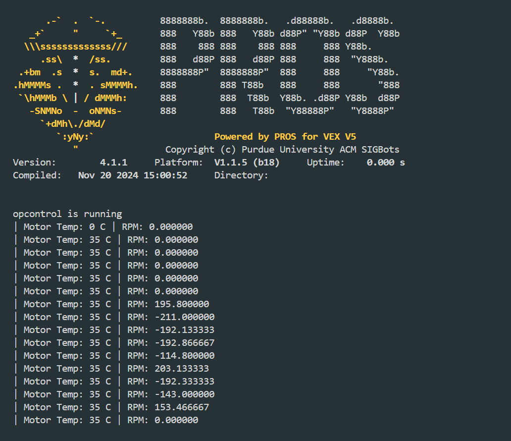

<!-- Improved compatibility of back to top link: See: https://github.com/othneildrew/Best-README-Template/pull/73 -->
<a name="readme-top"></a>
<!--
*** Thanks for checking out the Best-README-Template. If you have a suggestion
*** that would make this better, please fork the repo and create a pull request
*** or simply open an issue with the tag "enhancement".
*** Don't forget to give the project a star!
*** Thanks again! Now go create something AMAZING! :D
-->


<!-- PROJECT SHIELDS -->
<!--
*** I'm using markdown "reference style" links for readability.
*** Reference links are enclosed in brackets [ ] instead of parentheses ( ).
*** See the bottom of this document for the declaration of the reference variables
*** for contributors-url, forks-url, etc. This is an optional, concise syntax you may use.
*** https://www.markdownguide.org/basic-syntax/#reference-style-links
-->
<div align="center">

[](https://github.com/10012E/PROS-VEXLink-Example/issues)
[![MIT License][license-shield]][license-url]
</div>

<!-- PROJECT LOGO -->
<br />
<div align="center">
  <a href="https://github.com/10012E/PROS-VEXLink-Example/tree/main">
    
  </a>

  <h3 align="center">Example for VEXLink Using PROS</h3>

  <p align="center">
A simple demo for using VEXLink with PROS
    <br />
    <a href="https://github.com/10012E/PROS-VEXLink-Example/issues">Report Bug</a>
    ·
    <a href="https://github.com/10012E/PROS-VEXLink-Example/issues">Request Feature</a>
  </p>
</div>


<!-- TABLE OF CONTENTS -->
<details>
  <summary>Table of Contents</summary>
  <ol>
    <li>
      <a href="#about-the-project">About The Project</a>
      <ul>
        <li><a href="#built-with">Built With</a></li>
      </ul>
    </li>
    <li>
      <a href="#getting-started">Getting Started</a>
      <ul>
        <li><a href="#Define What Your Sending">What am I sending?</a></li>
        <li><a href="#Sending Data">Installation</a></li>
        <li><a href="#The Control Centre">The Control Centre</a></li>
      </ul>
    </li>
    <li><a href="#usage">Usage</a></li>
    <li><a href="#contributing">Contributing</a></li>
    <li><a href="#license">License</a></li>
    <li><a href="#acknowledgments">Acknowledgments</a></li>
  </ol>
</details>


<!-- ABOUT THE PROJECT -->
## About The Project
<div align="center">
  
  </div>
  <br>
This is a basic example of how you can use the PROS extension on VSCode and the VEXLink system to communicate with your device and your robot.

Here's why:
* Have you ever been working on auto and when you want to find coordinates you need to check either the brain or controller.
* * Maybe your controller is in a place that is difficult to access
    * * Possibly in a match and you want to monitor how your coding is doing to make adjustments
* Need to check motor temps to see if their over heating
* Tuning PIDs

Of course, this is <strong>not</strong> a example to copy without understanding. It's important to understant how projects work in VRC. This README will explain how this works! 😄

<p align="right">(<a href="#readme-top">back to top</a>)</p>


### Built With

This section should list any major frameworks/libraries in this example.
<br>
  <a href="https://pros.cs.purdue.edu/v5/pros-4/index.html">PROS 4</a>
  <br>
  <a href="https://drive.google.com/file/d/13mTA6BT7CPskJzh4YgsfAfoH9OgK75Hn/view">VEXLink Documentation</a>
<p align="right">(<a href="#readme-top">back to top</a>)</p>


<!-- GETTING STARTED -->
## Getting Started

Here we'll explain the basic framework of this code.
<br><br><br>
Before we even start, if you haven't downloaded pros follow the instructions <a href="https://pros.cs.purdue.edu/v5/pros-4/getting-started.html">here</a>.
With PROS 4 using the main.h file is absolutely necessary, if not used your program will error and fail. So the program starts by including this file:

```sh
#include "main.h"
```
### Define What You're Sending<br>
For this example I chose to take information from a motor. You may use any type of device in VRC that is legal. The general process stays the same. Refer to the <a href="https://pros.cs.purdue.edu/v5/pros-4/index.html">PROS Documentation</a> for information regarding taking information from external sensor and devices.
My code was the following:<br>
```sh
pros::Motor motor(10, pros::MotorGears::blue); // Adding a Blue Motor to the port 10
```

I also added a controller so I can control the speed of the motor to test my function. Refer to other repos for info on how to create this.


### Sending Data
<br>
This is when things start to get a little tricky, however, they are still relatively simple. Let's go through it 🙂:

<br>
Right before we dig in, we surrond all of this in a while (true) loop, this insures that the program will continue to scan for new information. If we didn't have this then the data will only be sent once.
<br>

```sh
std::uint32_t motor_temp = motor.get_temperature(); // Get the motor
```
To explain this we need to dive into a bit of simple syntax:<br><br>

std::  =  refers to a common c++ library, named Standard Library<br>
uint32_t = Unsigned Integers = integers only 0 and + numbers. The 32 refers to the size of the number:<br>

| uint  | Range |
| ------|------ |
| uint8_t  | 0-255 (2^8)  |
| uint16_t  | 0-65536 (2^16)  |
| uint32_t | 0-4294967296 (2^32)|
| uint64_t | 0-18446744073709551615 (2^64)|

Some sizes are overkill for our situation.<br><br>

What I did for this was create my variable for motor temps, so I ended up using the uint32_t.<br>
```sh
    std::uint32_t motor_temp = motor.get_temperature(); // Get the motor
    std::uint32_t motor_rpm = motor.get_actual_velocity();
```

The next thing that we'll look at is the "if" "else" block of code:<br>
    We now are going to look to see if the data we are reciving is invalid:
```sh
 if (motor_temp || motor_rpm == PROS_ERR_F) { // If the temperature reading is invalid
```
<br>
We fetch the motor temp and RPM and ask (==) if either (we use || to call "or" operator, so ⬇️) are equal to error.<br>

```sh
if (motor_temp or motor_rpm == PROS_ERR_F) { // If the temperature reading is invalid
```

Next, we tell the program what do do if there is an error:

```sh
      printf("Error reading motor temperature\n");
```
<br>
Next if this statement is false we use the else function and it will print the data on our screen.

```sh
    } else { // If the temperature reading is valid
      // Debug print to indicate the motor temperature
      printf("| Motor Temp: %u C | RPM: %u \n", motor_temp, //the | are just to separate the columns of data.
             motor_rpm);
    }
```
<br>

Finally probably the most important part of this function is the `pros::delay(100)`, this simply tells the program to break, this is vital for all while loops and especially while multi-tasking. However this also tells our program the interval for sending information.

### The control Centre
<br>

```sh
/*This is the main function that runs when the robot is turned on*/
void opcontrol() {
  pros::Link link(21, "my_link", pros::E_LINK_TX); // Create a link radio

  // Debug print to indicate that opcontrol is running
  printf("opcontrol is running\n");
  pros::Task task2(Data);
  pros::Task task(spin);
}
```
This is the brain of the program, while this program isn't the first to run it will run before the functions that you write. Knowing this we can define our radio here. we use the `pros::Link` function; we also need to define what we are defining which is a `link`. Then inside the () we will define the port that has the radio which in my case is port 21. Lastly we have to tell the program what this radio will do. Here it will transmit information your computer, so we define it as such.<br><br>
`E_LINK_TX = E_LINK_TRANSMITTER`
<br><br>
The `printf("opcontrol is running\n");` is a debugging feature that will show up in your pros terminal and will allow you know if everything is working.<br><br>

Finally, we use the pros multi tasking to run both defining and sending the information.<br><br>

<p align="right">(<a href="#readme-top">back to top</a>)</p>

<hr><br>

<!-- USAGE EXAMPLES -->

## Usage

WAIT!!! How do I even view the information???? Well, you found the place right here! The first thing your going to do is go to the PROS extension and click intergrated terminal:
<br><br>

<br>
The next thing you're going to do is run the following command into your terminal (make sure you've built and uploaded to project as once you've started its a pain and gerenally what Ii've done is unplug and repulg in my USB. If you have a better way put it under <a href="https://github.com/10012E/PROS-VEXLink-Example/issues"> Issues</a>):

```sh
pros terminal
```
<br>

GREAT, now you can just run the program from either your controller or brain and it will send data live from your robot!

<!-- CONTRIBUTING -->
## Contributing

Contributions are AUSOME, so if you have any thing to add to make this better either add it as an <a href="https://github.com/10012E/PROS-VEXLink-Example/issues"> Issues </a> or see me in class.

<p align="right">(<a href="#readme-top">back to top</a>)</p>


<!-- LICENSE -->
## License

Distributed under the MIT License. See <a href="LICENSE">`LICENSE`</a> for more information.

<p align="right">(<a href="#readme-top">back to top</a>)</p>

<!-- ACKNOWLEDGMENTS -->
## Acknowledgments

<a href="https://pros.cs.purdue.edu/v5/pros-4/index.html"> PROS 4</a>
<a href="https://github.com/philb90/Best-README-Template"> README Template </a>


<p align="right">(<a href="#readme-top">back to top</a>)</p>


<!-- MARKDOWN LINKS & IMAGES -->
<!-- https://www.markdownguide.org/basic-syntax/#reference-style-links -->
[issues-shield]: https://img.shields.io/github/issues/othneildrew/Best-README-Template.svg?style=for-the-badge
[issues-url]: https://github.com/10012E/PROS-VEXLink-Example/issues
