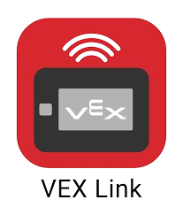

<!-- Improved compatibility of back to top link: See: https://github.com/othneildrew/Best-README-Template/pull/73 -->
<a name="readme-top"></a>
<!--
*** Thanks for checking out the Best-README-Template. If you have a suggestion
*** that would make this better, please fork the repo and create a pull request
*** or simply open an issue with the tag "enhancement".
*** Don't forget to give the project a star!
*** Thanks again! Now go create something AMAZING! :D
-->


<!-- PROJECT SHIELDS -->
<!--
*** I'm using markdown "reference style" links for readability.
*** Reference links are enclosed in brackets [ ] instead of parentheses ( ).
*** See the bottom of this document for the declaration of the reference variables
*** for contributors-url, forks-url, etc. This is an optional, concise syntax you may use.
*** https://www.markdownguide.org/basic-syntax/#reference-style-links
-->

<!-- PROJECT LOGO -->
<br />
<div align="center">
  <a href="https://github.com/10012E/PROS-VEXLink-Example/tree/main">
    
  </a>

  <h3 align="center">Example for VEXLink Using PROS</h3>

  <p align="center">
A simple demo for using VEXLink with PROS
    <br />
    <a href="https://github.com/10012E/PROS-VEXLink-Example/issues">Report Bug</a>
    ·
    <a href="https://github.com/10012E/PROS-VEXLink-Example/issues">Request Feature</a>
  </p>
</div>


<!-- TABLE OF CONTENTS -->
<details>
  <summary>Table of Contents</summary>
  <ol>
    <li>
      <a href="#about-the-project">About The Project</a>
      <ul>
        <li><a href="#built-with">Built With</a></li>
      </ul>
    </li>
    <li>
      <a href="#getting-started">Getting Started</a>
      <ul>
        <li><a href="#Define What Your Sending">What am I sending?</a></li>
        <li><a href="#Sending Data">Installation</a></li>
      </ul>
    </li>
    <li><a href="#usage">Usage</a></li>
    <li><a href="#roadmap">Roadmap</a></li>
    <li><a href="#contributing">Contributing</a></li>
    <li><a href="#license">License</a></li>
    <li><a href="#contact">Contact</a></li>
    <li><a href="#acknowledgments">Acknowledgments</a></li>
  </ol>
</details>


<!-- ABOUT THE PROJECT -->
## About The Project
<div align="center">
  
  </div>
  <br>
This is a basic example of how you can use the PROS extension on VSCode and the VEXLink system to communicate with your device and your robot.

Here's why:
* Have you ever been working on auto and when you want to find coordinates you need to check either the brain or controller.
* * Maybe your controller is in a place that is difficult to access
    * * Possibly in a match and you want to monitor how your coding is doing to make adjustments
* Need to check motor temps to see if their over heating
* Tuning PIDs

Of course, this is <strong>not</strong> a example to copy without understanding. It's important to understant how projects work in VRC. This README will explain how this works! 😄

<p align="right">(<a href="#readme-top">back to top</a>)</p>


### Built With

This section should list any major frameworks/libraries in this example.
<br>
  <a href="https://pros.cs.purdue.edu/v5/pros-4/index.html">PROS 4</a>
  <br>
  <a href="https://drive.google.com/file/d/13mTA6BT7CPskJzh4YgsfAfoH9OgK75Hn/view">VEXLink Documentation</a>
<p align="right">(<a href="#readme-top">back to top</a>)</p>


<!-- GETTING STARTED -->
## Getting Started

Here we'll explain the basic framework of this code.
<br><br><br>

With PROS 4 using the main.h file is absolutely necessary, if not used your program will error and fail. So the program starts by including this file:

```sh
#include "main.h"
```
### Define What Your Sending
For this example I chose to take information from a motor. You may use any type of device in VRC that is legal. The general process stays the same. Refer to the <a href="https://pros.cs.purdue.edu/v5/pros-4/index.html">PROS Documentation</a> for information regarding taking information from external sensor and devices.
My code was the following:
```sh
pros::Motor motor(10, pros::MotorGears::blue); // Adding a Blue Motor to the port 10
```

I also added a controller so I can control the speed of the motor to test my function. Refer to other repos for info on how to create this.


### Sending Data
This is when things start to get a little tricky, however, they are still relatively simple. Let's go through it 🙂:

<br>
Right before we dig in, we surrond all of this in a while (true) loop, this insures that the program will continue to scan for new information. If we didn't have this then the data will only be sent once.
<br>
```sh
    std::uint32_t motor_temp = motor.get_temperature(); // Get the motor
```
To explain this we need to dive into a bit of simple syntax:<br><br>

std::  =  refers to a common c++ library, named Standard Library<br>
uint32_t = Unsigned Integers = integers only 0 and + numbers. The 32 refers to the size of the number:<br>

| uint  | Range |
| ------|------ |
| uint8_t  | 0-255 (2^8)  |
| uint16_t  | 0-65536 (2^16)  |
| uint32_t | 0-4294967296 (2^32)|
| uint64_t | 0-18446744073709551615 (2^64)|

Some sizes are overkill for our situation.<br><br>

What I did for this was create my variable for motor temps, so I ended up using the uint32_t.<br>
```sh
    std::uint32_t motor_temp = motor.get_temperature(); // Get the motor
```

The next thing that we'll look at is the "if" "else" bl0ck of code


<!-- USAGE EXAMPLES -->
## Usage

Use this space to show useful examples of how a project can be used. Additional screenshots, code examples and demos work well in this space. You may also link to more resources.

_For more examples, please refer to the [Documentation](https://example.com)_

<p align="right">(<a href="#readme-top">back to top</a>)</p>


<!-- ROADMAP -->
## Roadmap

- [x] Add Changelog
- [x] Add back to top links
- [ ] Add Additional Templates w/ Examples
- [ ] Add "components" document to easily copy & paste sections of the readme
- [ ] Multi-language Support
    - [ ] Chinese
    - [ ] Spanish

See the [open issues](https://github.com/othneildrew/Best-README-Template/issues) for a full list of proposed features (and known issues).

<p align="right">(<a href="#readme-top">back to top</a>)</p>


<!-- CONTRIBUTING -->
## Contributing

Contributions are what make the open source community such an amazing place to learn, inspire, and create. Any contributions you make are **greatly appreciated**.

If you have a suggestion that would make this better, please fork the repo and create a pull request. You can also simply open an issue with the tag "enhancement".
Don't forget to give the project a star! Thanks again!

1. Fork the Project
2. Create your Feature Branch (`git checkout -b feature/AmazingFeature`)
3. Commit your Changes (`git commit -m 'Add some AmazingFeature'`)
4. Push to the Branch (`git push origin feature/AmazingFeature`)
5. Open a Pull Request

<p align="right">(<a href="#readme-top">back to top</a>)</p>


<!-- LICENSE -->
## License

Distributed under the MIT License. See `LICENSE.txt` for more information.

<p align="right">(<a href="#readme-top">back to top</a>)</p>


<!-- CONTACT -->
## Contact

Your Name - [@your_twitter](https://twitter.com/your_username) - email@example.com

Project Link: [https://github.com/your_username/repo_name](https://github.com/your_username/repo_name)

<p align="right">(<a href="#readme-top">back to top</a>)</p>


<!-- ACKNOWLEDGMENTS -->
## Acknowledgments

Use this space to list resources you find helpful and would like to give credit to. I've included a few of my favorites to kick things off!

* [Choose an Open Source License](https://choosealicense.com)
* [GitHub Emoji Cheat Sheet](https://www.webpagefx.com/tools/emoji-cheat-sheet)
* [Malven's Flexbox Cheatsheet](https://flexbox.malven.co/)
* [Malven's Grid Cheatsheet](https://grid.malven.co/)
* [Img Shields](https://shields.io)


<p align="right">(<a href="#readme-top">back to top</a>)</p>


<!-- MARKDOWN LINKS & IMAGES -->
<!-- https://www.markdownguide.org/basic-syntax/#reference-style-links -->
[issues-shield]: https://img.shields.io/github/issues/othneildrew/Best-README-Template.svg?style=for-the-badge
[issues-url]: https://github.com/othneildrew/Best-README-Template/issues
